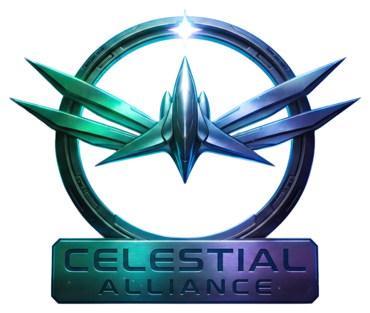
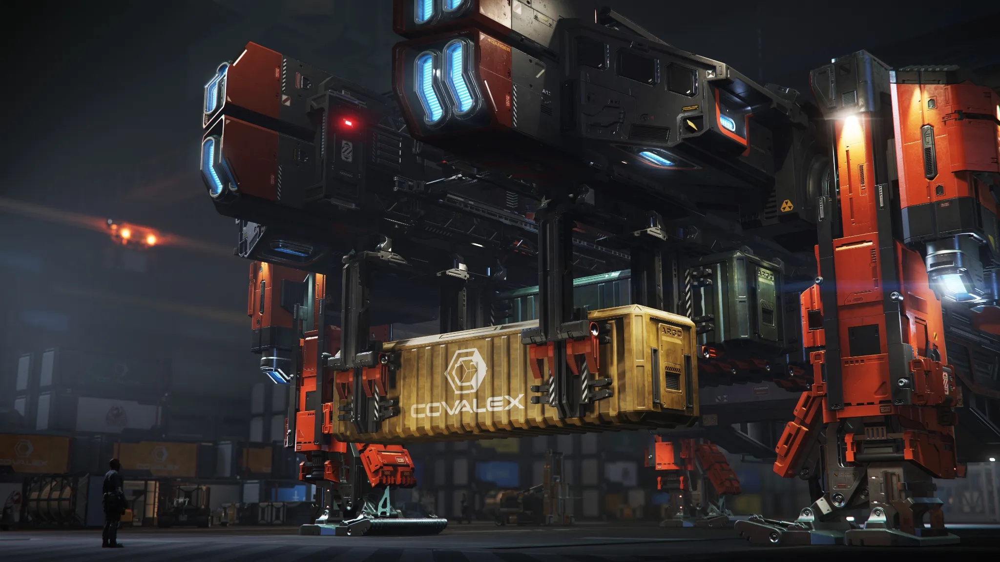

<div align="center">
  

# Celestial Alliance Nexus Toolkit

### A unified Star Citizen operations, engineering, logistics, intelligence, and organization workspace

[](release.json)
[](https://github.com/Elusyon117/Celestial-Alliance-Nexus-toolKit/actions/workflows/validate-toolkit.yml)
[](https://github.com/Elusyon117/Celestial-Alliance-Nexus-toolKit/actions/workflows/sync-game-data.yml)
[](manifest.webmanifest)
[](#getting-started)

**Built and maintained by [Elusyon](https://robertsspaceindustries.com/en/citizens/Elusyon) for Celestial Alliance and the wider Star Citizen community.**

[Module Directory](#module-directory) · [Getting Started](#getting-started) · [Data & Offline Support](#data-and-offline-support) · [Repository Guide](#repository-guide) · [Workflows](#automation-and-workflows)
</div>

<p align="center">
  
</p>

> [!NOTE]
> Celestial Nexus is an unofficial community project and is not endorsed by or affiliated with Cloud Imperium Games or Roberts Space Industries. Star Citizen names, imagery, and related intellectual property belong to their respective owners.

---

## Overview

Celestial Nexus brings the tools commonly needed before, during, and after Star Citizen operations into one browser-based command center. It combines mission planning, ship and weapon configuration, logistics, economy research, crafting intelligence, mining guidance, organization media tools, localization utilities, service-status information, and experimental control-profile development.

The toolkit is designed around four principles:

- **Operational clarity** — turn scattered information into practical mission decisions.
- **Resilient data access** — combine live sources, verified repository mirrors, local fallbacks, and browser caches.
- **Shareable outputs** — export plans, builds, routes, manifests, images, text, JSON, CSV, XML, and installation packages where supported.
- **Local-first workflows** — preserve user-created configurations in the browser whenever possible and avoid requiring a dedicated backend.

### Toolkit at a glance

| Area | Capabilities |
|---|---|
| Operations | Event planning, mission briefings, ship assignments, crew roles, roster-aware workflows |
| Engineering | Vehicle loadouts, compatible components, crafted quality, performance modelling |
| Armory | FPS weapon attachments, recoil, spread, stat comparisons, saved builds |
| Intelligence | Contract search, item discovery, crafting blueprints, game status, official and community information |
| Logistics | Cargo routing, cargo-grid planning, capacity validation, payout and time estimates |
| Industry | Wikelo requirements, commodity trading, mining resources and field guidance |
| Customization | Localization editing, organization artwork, reusable visual projects |
| Development | Flight-stick bindings, curves, presets, device profiles and XML exports |

---

## Module directory

The current hub contains **14 numbered modules**. NX-01 through NX-12 and NX-14 are operational modules. NX-13 is intentionally presented as a development preview.

<table>
  <tr>
    <td width="50%" valign="top">
      
      <h3>NX-01 · Event Planner</h3>
      <p>Build alliance-ready operations from the first briefing through final crew assignments.</p>
      <p><strong>Includes:</strong> event identity and cover art, mission briefing fields, ship and unit sections, editable crew roles, priority levels, participant assignments, drag-and-drop ordering, roster integration, saved setups, Discord-ready text, and image exports.</p>
    </td>
    <td width="50%" valign="top">
      
      <h3>NX-02 · Vehicle Loadout Manager</h3>
      <p>Configure ship hardpoints and evaluate component choices before deployment.</p>
      <p><strong>Includes:</strong> vehicle selection, compatible component discovery, stock and custom parts, hardpoint configuration, crafted-quality modelling, stat comparisons, performance charts, pricing, shopping lists, checklists, saved builds, import/export, and loadout images.</p>
    </td>
  </tr>
  <tr>
    <td width="50%" valign="top">
      
      <h3>NX-03 · Contract Finder</h3>
      <p>Search the verified mission catalog and turn contract data into actionable planning intelligence.</p>
      <p><strong>Includes:</strong> reward, reputation, location, legality, requirement, mission-chain, employer, and category filtering; detailed mission records; live-refresh handling; repository snapshot fallbacks; and mission-data import/export support.</p>
    </td>
    <td width="50%" valign="top">
      
      <h3>NX-04 · Item Finder</h3>
      <p>Research equipment, specifications, store locations, pricing, and availability from one workspace.</p>
      <p><strong>Includes:</strong> category and text search, item specifications, manufacturer and classification details, store and terminal records, current price listings, marketplace references, image fallbacks, and links to supporting data sources.</p>
    </td>
  </tr>
  <tr>
    <td width="50%" valign="top">
      
      <h3>NX-05 · Blueprint Finder</h3>
      <p>Trace fabrication requirements before committing time, materials, or organization resources.</p>
      <p><strong>Includes:</strong> blueprint and recipe search, unlock and acquisition information, required materials, crafted outputs, quality controls, projected stat effects, visual component symbols, and fabrication-focused filters.</p>
    </td>
    <td width="50%" valign="top">
      
      <h3>NX-06 · Cargo Hauling Routing</h3>
      <p>Build multi-stop hauling plans with capacity, time, cost, and payout validation.</p>
      <p><strong>Includes:</strong> contract and route sequencing, ship-capacity checks, cargo totals, pickup and delivery legs, travel assumptions, fuel estimates, ETA calculations, profitability summaries, route swapping, and CSV, JSON, PNG, and briefing exports.</p>
    </td>
  </tr>
  <tr>
    <td width="50%" valign="top">
      
      <h3>NX-07 · Wikelo Trade Center</h3>
      <p>Track alien trade requirements and organize the resources needed to complete favor exchanges.</p>
      <p><strong>Includes:</strong> trade and reward records, favor requirements, completion-cost calculations, organization material tracking, reputation guidance, completion status, special-item identification, and full trade-plan text export.</p>
    </td>
    <td width="50%" valign="top">
      
      <h3>NX-08 · Commodity Trading</h3>
      <p>Compare market opportunities while accounting for cargo limits, travel, and confidence.</p>
      <p><strong>Includes:</strong> commodity and terminal research, buy and sell comparisons, ship cargo capacity, route profitability, investment and revenue estimates, fuel-aware calculations, market confidence, route reversal, and reusable trade plans.</p>
    </td>
  </tr>
  <tr>
    <td width="50%" valign="top">
      
      <h3>NX-09 · Mining Resources Command</h3>
      <p>Turn resource data into practical field routes and mining configurations.</p>
      <p><strong>Includes:</strong> resource and region discovery, planetary and asteroid guidance, mining-platform selection, mining heads, modules and gadgets, fracture and extraction guidance, favorite resources, location recommendations, and field-ready loadout planning.</p>
    </td>
    <td width="50%" valign="top">
      
      <h3>NX-10 · Language Pack Lab</h3>
      <p>Create a clearer and more personalized Star Citizen localization file.</p>
      <p><strong>Includes:</strong> repository-mirrored StarStrings data, clean <code>global.ini</code> import, search and filtering, custom terminology, aliases, direct key editing, previews, reset controls, downloadable files, and install-ready ZIP generation.</p>
    </td>
  </tr>
  <tr>
    <td width="50%" valign="top">
      
      <h3>NX-11 · Org Picture Creator</h3>
      <p>Produce alliance-ready graphics without leaving the toolkit.</p>
      <p><strong>Includes:</strong> reusable templates, image uploads, custom canvas sizes, text, lines and shapes, branding palettes, safe-area guides, layer-aware editing, undo/redo, project save/load, reusable styles, and high-quality PNG export.</p>
    </td>
    <td width="50%" valign="top">
      
      <h3>NX-12 · Game Status &amp; Intel</h3>
      <p>Monitor the current environment and keep official information separate from community intelligence.</p>
      <p><strong>Includes:</strong> RSI service-health information, live-build and patch details, official news, Wiki intelligence, source labels, refresh controls, network fallbacks, and clearly identified optional community or datamined information.</p>
    </td>
  </tr>
  <tr>
    <td width="50%" valign="top">
      
      <h3>NX-13 · Flight Profile Builder <sup>WIP</sup></h3>
      <p>A development workspace for building and sharing flight-control configurations.</p>
      <p><strong>Planned and previewed capabilities:</strong> device profiles, joystick and throttle ordering, bindings, response curves, dead zones, input testing, reusable presets, project files, and Star Citizen-compatible XML exports.</p>
    </td>
    <td width="50%" valign="top">
      
      <h3>NX-14 · FPS Weapon Loadout Manager</h3>
      <p>Configure personal weapons and understand how attachments and quality settings change performance.</p>
      <p><strong>Includes:</strong> weapon selection, compatible attachment ports, optics, barrels, underbarrel devices, magazines, crafted-quality presets, complete stat deltas, recoil and spread visualization, relative-performance charts, saved builds, and JSON export.</p>
    </td>
  </tr>
</table>

---

## Integrated utility · Cargo Grid Manager

<p align="center">
  
</p>

Cargo Grid Manager extends the NX-06 logistics workflow with a visual cargo-placement workspace. It supports crate placement, grid-aware positioning, automatic packing, view rotation, placement history, capacity feedback, cargo manifests, and image exports. It is documented separately because it functions like a complete workspace while remaining part of the broader hauling and logistics toolset.

---

## Shared capabilities

Although each module has its own purpose, the toolkit reuses a common set of platform features:

- Responsive desktop and mobile layouts
- Hub-based navigation with persistent application views
- Browser storage for reusable user configurations
- Import and export workflows appropriate to each module
- Local artwork with remote and generated fallbacks
- Toasts, status indicators, loading states, and diagnostics
- Reduced-motion, hidden-view pausing, and performance safeguards
- PWA installation and versioned service-worker caches
- Network-aware data adapters with verified local snapshots where available

---

## Getting started

### Use in a browser

1. Open the deployed toolkit in a current version of Chrome, Edge, Firefox, or Safari.
2. Select a module from the Nexus hub.
3. Allow the selected module to load its local or network-backed data.
4. Save or export your work from the controls provided inside that module.

No account or dedicated application server is required for the core interface. Some modules depend on public third-party services and may fall back to repository mirrors or cached data when a provider is unavailable.

### Run locally

A local web server is recommended because service workers, fetch requests, modules, and browser security rules do not behave correctly when the page is opened directly through a <code>file://</code> URL.

```bash
# Clone the repository
git clone https://github.com/Elusyon117/Celestial-Alliance-Nexus-toolKit.git
cd Celestial-Alliance-Nexus-toolKit

# Start any static web server
python -m http.server 8080
```

Then open:

```text
http://localhost:8080
```

### Install as a PWA

On a supported browser, open the deployed toolkit and use the browser's **Install app** or **Add to Home Screen** option. The service worker provides a versioned application shell, runtime data caching, image caching, stale-cache cleanup, and offline fallbacks for previously available resources.

> [!IMPORTANT]
> After a major release, refresh the page once or reopen the installed app so the newest service worker can activate and remove older versioned caches.

---

## Data and offline support

Celestial Nexus combines several data-delivery strategies instead of relying on a single provider.

| Strategy | Purpose |
|---|---|
| Live requests | Retrieve current public information when a source is available |
| Repository mirrors | Preserve validated datasets required by core modules |
| Generated browser files | Make large datasets directly consumable by the static application |
| Runtime cache | Reuse successful responses and improve resilience |
| Local fallback assets | Keep module artwork and essential interface resources available |
| User imports | Allow controlled recovery or replacement of supported datasets |

### Important tracked data

The repository intentionally tracks validated or operational data such as:

- SCMDB mission snapshots and browser-ready mission data
- Game-data status and patch-audit records
- Organization roster data
- MrKraken/StarStrings localization mirrors and release metadata
- Local images required by modules and service-worker fallbacks

These files are part of the application and should not be deleted as ordinary generated clutter.

### Source network

The toolkit references or adapts information from sources including:

- Roberts Space Industries / Cloud Imperium Games
- SCMDB
- UEX Corp
- Star Citizen Wiki and its public API
- MrKraken StarStrings / localization resources
- Cornerstone / CStone
- The Space Coder Armory
- Clearly labeled community intelligence sources

Availability, schemas, prices, missions, items, and game behavior may change between patches. The interface uses source labels, status records, verified snapshots, and fallbacks to make those limitations visible.

---

## Saving, importing, and exporting

Different modules expose different formats according to their workflows. Across the toolkit, supported output types include:

- PNG images and presentation cards
- Plain-text and Discord-ready briefings
- JSON project, configuration, snapshot, and loadout files
- CSV route or logistics records
- XML control profiles
- Localization INI files and installation ZIP packages

Most reusable user settings are stored in the current browser profile. Clearing site data, using private browsing, or changing devices may remove locally saved configurations unless they have been exported first.

---

## Automation and workflows

The repository uses GitHub Actions to validate the application and maintain selected data mirrors.

| Workflow | Trigger | Responsibility |
|---|---|---|
| **Validate toolkit** | Push to `main`, pull request, manual | Checks JavaScript syntax, repository integrity, local references, required files, data consistency, service-worker entries, workflow structure, and checksums |
| **Sync game data** | Every six hours, manual | Refreshes and audits the SCMDB mission catalog while preserving the last verified snapshot during upstream failures |
| **Sync MrKraken language pack** | Weekly, manual | Downloads and validates the current StarStrings LIVE localization mirror and preserves the previous valid mirror when necessary |
| **Restore or sync SCMDB 4.9 contracts** | Manual | Recovers a verified contract snapshot from the repository, history, or a strict direct synchronization path |

Generated-data workflows only commit the files they are responsible for and use pull/rebase/push retry handling to reduce conflicts with other repository activity.

---

## Repository guide

```text
.
├── index.html                  # Current browser application
├── 404.html                    # GitHub Pages application redirect
├── manifest.webmanifest        # PWA identity and install metadata
├── sw.js                       # Versioned service worker and cache strategies
├── release.json                # Release and cache-version source of truth
├── VERSION.txt                 # Plain-text application version
├── SHA256SUMS.txt              # Integrity records for release-critical files
├── assets/                     # Module artwork, interface assets, references, and fallbacks
├── data/                       # Verified mirrors, status records, audits, and roster data
├── icons/                      # PWA icon set
├── scripts/                    # Data synchronization, recovery, audit, and validation tools
├── docs/                       # Release, validation, deployment, and maintenance documentation
└── .github/workflows/          # Validation and data-maintenance automation
```

### Files that must remain aligned

A release update may require coordinated changes across:

- `release.json`
- `VERSION.txt`
- Version metadata and visible labels in `index.html`
- The service-worker version and registration query
- Manifest icon cache tags
- `SHA256SUMS.txt`
- Release notes and documentation

Run the repository validator after every release-sensitive change.

---

## Validation

The local validator requires a current Node.js runtime compatible with the repository workflows.

```bash
node scripts/validate-repo.mjs
```

The validation process checks the static application without executing its interactive module logic. A passing report confirms repository integrity, syntax, references, data contracts, and workflow expectations; it does not replace a deployed-browser interaction test.

Recommended release verification:

1. Run the validator locally.
2. Push through a branch or pull request.
3. Confirm **Validate toolkit** passes.
4. Wait for the static deployment to finish.
5. Open the deployed site in a private window or after a hard refresh.
6. Open every numbered module.
7. Exercise at least one save/export path in each major workflow family.
8. Confirm the installed PWA updates to the new cache revision.

---

## Browser and network considerations

- External services can be affected by CORS policies, rate limits, DNS failures, provider maintenance, or schema changes.
- Cached or mirrored data may remain usable when an upstream service is temporarily unavailable.
- A status marked as stale does not automatically mean the stored dataset is invalid; review the accompanying status and audit records.
- Local browser storage is isolated by site origin and browser profile.
- Large datasets and advanced visual modules may perform best on desktop hardware.

---

## Project status

**Version 2.0.0** establishes the repository's documentation and cleanup baseline. The modernization effort prioritizes compatibility: existing module behavior, user storage, generated datasets, workflows, service-worker behavior, and exports should be preserved while the monolithic application is progressively organized and simplified.

### Current priorities

- Maintain a reliable and fully documented module catalog
- Consolidate release and version information
- Identify and archive superseded repository documentation
- Protect generated data and workflow dependencies
- Gradually separate stable module code without breaking global integrations
- Expand regression validation before removing historical compatibility layers

---

## Credits

Created by **[Elusyon](https://robertsspaceindustries.com/en/citizens/Elusyon)** for **Celestial Alliance**.

Community feedback, testing, data providers, localization maintainers, Wiki contributors, tool builders, and organization members all help make this project possible.

- Celestial Alliance Discord: [Join the community](https://discord.gg/celestial-alliance)
- Repository issues: use GitHub Issues for reproducible defects, data problems, and maintenance requests

---

<div align="center">
  

  **Plan clearly. Configure deliberately. Fly together.**

  <sub>Celestial Alliance community toolkit · Unofficial Star Citizen fan project</sub>
</div>
